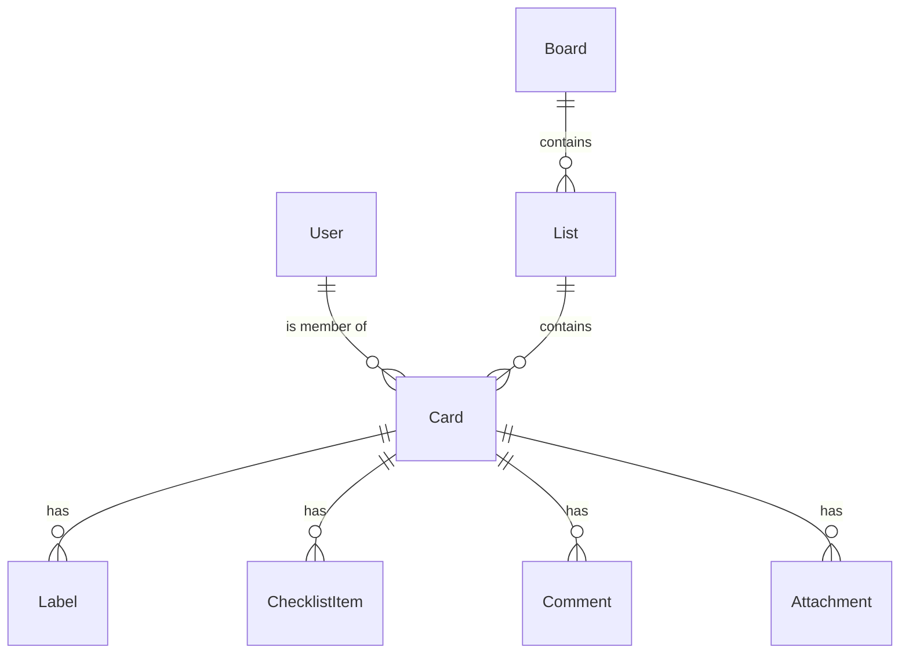

# Trello Clone — Kanban Project Management Tool

A full-stack Kanban-style project management web app built with **Next.js 16**, **Prisma**, and **PostgreSQL**.

---

## Tech Stack

| Layer | Technology |
|-------|-----------|
| Frontend | Next.js 16 (App Router), React 19, Tailwind CSS 4 |
| Backend | Next.js API Routes (Node.js 20+) |
| Database | PostgreSQL via Prisma ORM (Neon / Docker) |
| Drag & Drop | @hello-pangea/dnd |
| Icons | lucide-react |

---

## Features

### ✅ Core Features
- **Intuitive Board Management** — Create multiple boards with dynamic background gradients; centralized dashboard for all projects.
- **Dynamic List Management** — Create, rename, and delete lists with ease.
- **Seamless Drag & Drop** — Smooth reordering of cards and lists powered by `@hello-pangea/dnd`.
- **Comprehensive Card Details**
  - **Labels** — Multi-select colored labels for organization.
  - **Due Dates** — Track deadlines with automatic highlighting for overdue tasks.
  - **Checklists** — Detailed sub-task tracking with real-time progress bars.
  - **Member Assignment** — Assign tasks to team members from a global user pool.
- **Advanced Search & Filtering** — Instant filtering by title, labels, members, or due dates.

### ⭐ Premium & Bonus Features
- **User Activity & Comments** — Full audit trail and threaded comments for better collaboration.
- **File Attachments** — Robust file management directly within card details.
- **Responsive Design** — Fully optimized for Mobile, Tablet, and Desktop views.
- **Visual Excellence** — Modern glassmorphism UI with vibrant gradients and smooth micro-animations.
- **Archival System** — Clean up your workspace by archiving completed cards without losing data.

---

## Setup Instructions

### Prerequisites
- Node.js 18+
- npm

### 1. Install Dependencies
```bash
npm install
```

### 2. Set Up Environment Variables
Create a `.env` file in the root directory (using `.env.example` as a template if available) and add your database URL:
```env
DATABASE_URL="postgresql://..."
```

### 3. Initialize the Database
```bash
# Start local Postgres if using Docker
docker-compose up -d

# Push schema to the database
npx prisma db push

# Seed with sample data (boards, lists, members, etc.)
npm run db:seed
```

### 4. Start the Development Server
```bash
npm run dev
```

Open [http://localhost:3000](http://localhost:3000) in your browser.

---

### Model Overview


- **User** — Team members with assigned tasks.
- **Board** — High-level project containers with unique visual styles.
- **List** — Categorical workflow stages (e.g., "To Do", "Done").
- **Card** — Actionable tasks with detailed descriptions, due dates, and activity logs.
- **Label** — Qualitative tags for quick visual categorization.
- **ChecklistItem** — Granular sub-tasks within a card.
- **Comment & Attachment** — Collaborative tools for team communication and file sharing.

---

## Assumptions

- No authentication required — a default workspace is shown to all users
- Sample members (Alice, Bob, Carol, Dave) are seeded for the assignment functionality
- Uses PostgreSQL for database storage (Neon or local Docker)
- The `archived` field soft-hides cards from the board view without deletion

---

## Project Structure

```
src/
├── app/
│   ├── page.tsx                  # Home (boards list)
│   ├── board/[boardId]/
│   │   ├── page.tsx              # Board page (SSR data fetch)
│   │   └── BoardWrapper.tsx      # Interactive board (drag & drop, filters)
│   └── api/
│       ├── boards/               # GET all, POST create
│       ├── boards/[boardId]/     # GET single board with lists+cards
│       ├── lists/                # POST create
│       ├── lists/[listId]/       # PATCH rename, DELETE
│       ├── lists/reorder/        # PUT reorder
│       ├── cards/                # POST create
│       ├── cards/[cardId]/       # PATCH update, DELETE
│       ├── cards/[cardId]/labels/         # POST add label
│       ├── cards/[cardId]/labels/[labelId]/ # DELETE label
│       ├── cards/[cardId]/members/        # POST assign, DELETE unassign
│       ├── cards/[cardId]/checklists/     # POST add item
│       ├── cards/[cardId]/comments/       # GET/POST comments
│       ├── cards/[cardId]/attachments/    # GET/POST attachments
│       ├── cards/reorder/        # PUT reorder
│       ├── checklists/[id]/      # PATCH toggle, DELETE
│       ├── comments/[id]/        # DELETE
│       ├── attachments/[id]/     # DELETE
│       └── users/                # GET all users
├── components/
│   ├── CardModal.tsx             # Full card detail modal
│   └── CreateBoardButton.tsx     # Board creation UI
└── lib/
    └── prisma.ts                 # Prisma client singleton
```

---

## 🎨 Design Aesthetics

This application is designed with a focus on **visual excellence** and **premium UX**:
- **Glassmorphism UI** — Translucent panels and layered interfaces for a modern, airy feel.
- **Vibrant Gradients** — Carefully curated background colors that make each board unique.
- **Inter Typography** — Using high-quality fonts for maximum readability and a professional look.
- **Micro-Animations** — Subtle hover states and smooth transitions for a highly responsive feel.
- **Modern Color Palette** — Harmonious HSL-based colors for labels and UI elements.

